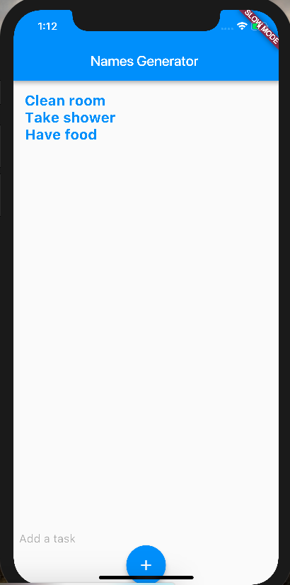

# todoapp_flutter_dart

A new Flutter project.

## Getting Started

For help getting started with Flutter, view our online
[documentation](https://flutter.io/).

## Steps of doneness

- Install Dart
- Install Flutter
- VS code 
    - Install 'Dart Code' plugin & reload
    - Check if the PATH variable is set(if not, restart machine)
    - Go to Command Pellete & run > Flutter:New Project
    - Go to Command Pellete & run > Flutter:Run Flutter Doctor
    - Install the missing dependencies
- Open XCode or Android Studio, build and run in Emulator.
